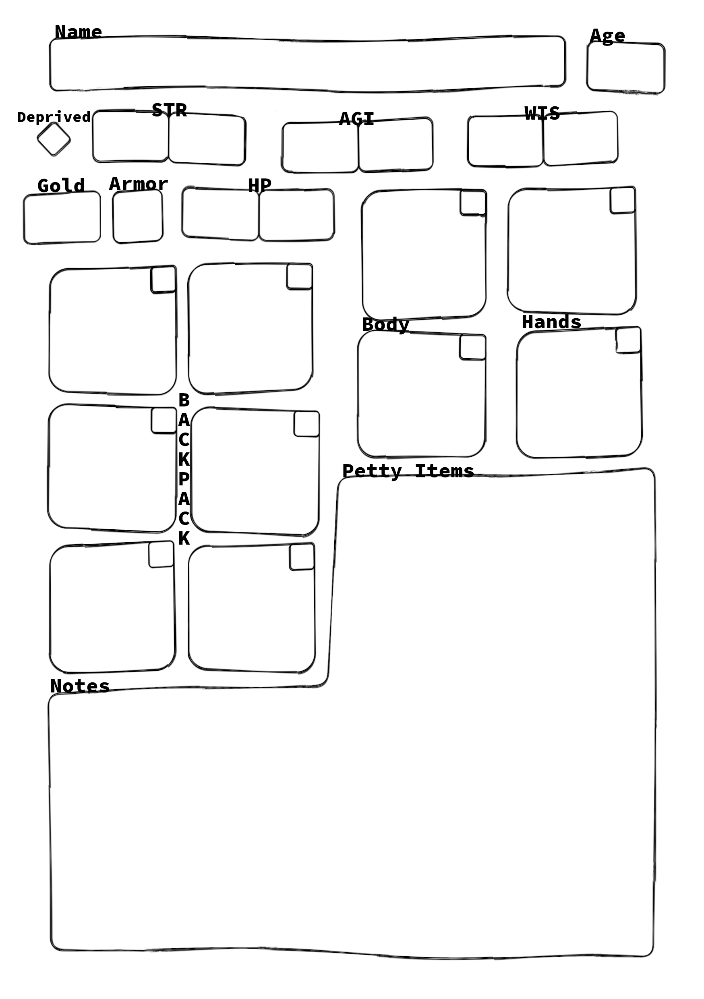

# DC-Cairn

This is a TTRPG rule set based on the wonderful [Cairn](https://cairnrpg.com/)

It is work in progress.

## The Book

- [Overview and Principles](/overview-and-principles.md)
- [Core Rules](/core-rules.md)
  - [Spells](/spells.md)
- [Character Creation](/character-creation.md)
  - [Backgrounds](/backgrounds/backgrounds.md)
  - [Marketplace](/marketplace.md)

## Character Sheet

## License

Each file is licensed under [CC-BY-SA 4.0.](https://creativecommons.org/licenses/by-sa/4.0), as per the original licence.

Shield: [![CC BY 4.0][cc-by-shield]][cc-by]

This work is licensed under a
[Creative Commons Attribution 4.0 International License][cc-by].

[![CC BY 4.0][cc-by-image]][cc-by]

[cc-by]: http://creativecommons.org/licenses/by/4.0/
[cc-by-image]: https://i.creativecommons.org/l/by/4.0/88x31.png
[cc-by-shield]: https://img.shields.io/badge/License-CC%20BY%204.0-lightgrey.svg
